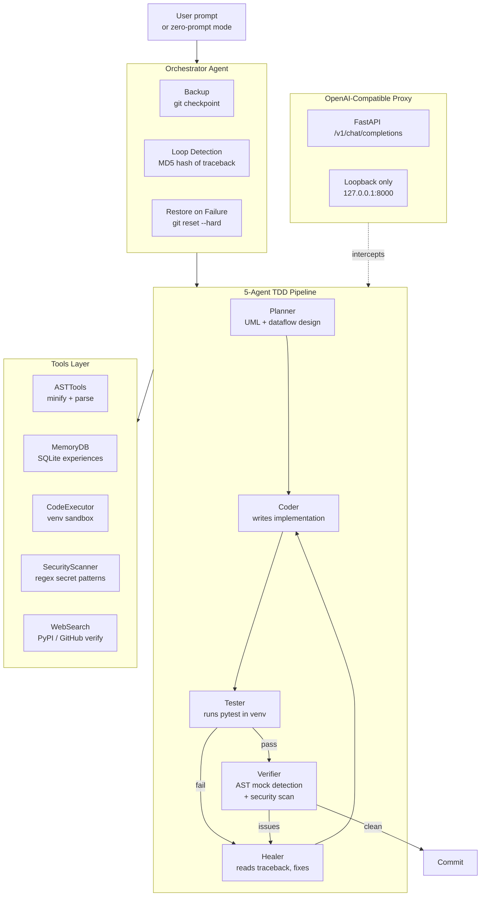

<h1 align="center">Self-Healing Multi-Agent Coding Assistant</h1>

<p align="center">
  <strong>Experimental prototype of a test-driven multi-agent coding loop with AST-based context minification and an OpenAI-compatible localhost proxy</strong>
</p>

<p align="center">
  <a href="https://www.python.org/"></a>
  <a href="https://fastapi.tiangolo.com/"></a>
  <a href="https://docs.pytest.org/"></a>
  <a href="https://github.com/ntd25022006q/self-healing-agent/blob/main/LICENSE"></a>
</p>

<p align="center">
  
  
  
</p>

---

## Honest Disclosure — Read First

This is an **experimental prototype**, not a production-ready product. The phrase "Production-ready" appears in historical commit messages; that wording is inaccurate and should be ignored.

### What this repo is

A Python multi-agent TDD loop with five agent roles — `Planner -> Coder -> Tester -> Healer -> Verifier` — orchestrated by `agents/orchestrator.py`, exposed as an OpenAI-compatible proxy at `http://127.0.0.1:8000/v1` (model id `self-healing-agent`). The proxy listens on the loopback interface only. The repo also includes an AST-based code minifier (`tools/ast_tools.py`), a SQLite-backed memory module (`tools/memory_db.py`), a web search tool (`tools/web_search.py`), a security scanner (`tools/security_scanner.py`), and a code executor (`tools/code_executor.py`).

### What this repo is not

- **Not a verified drop-in replacement for existing AI coding agents.** The README previously claimed compatibility with Cursor, Aider, Claude Code, Cline, Continue, Roo Code, Bolt, and OpenHands. **This compatibility is unverified.** The repo contains no integration tests against any of those tools. The proxy exposes an OpenAI-compatible `/v1` endpoint, but compatibility with each downstream tool has not been confirmed.
- **Not a 99% token compression tool.** The "99% Token Compression" claim in earlier README versions is marketing language. The actual `minify_code()` function in `tools/ast_tools.py` strips docstrings, comments, and blank lines via `ast.parse` / `ast.unparse`. Real savings depend on the docstring-to-code ratio of each codebase and range from approximately 10% (code with few comments) to 60% (docstring-heavy code). The function's own docstring says 30-50%; both numbers are estimates, not benchmarks.
- **Not a tested multi-agent pipeline.** The 9 unit tests cover only the `tools/` layer (`test_ast_tools.py`, `test_code_executor.py`, `test_memory_db.py`, `test_security_scanner.py`). The `agents/` pipeline (orchestrator, planner, coder, tester, healer, verifier) has **no tests**. The end-to-end multi-agent loop has not been verified by automated tests.

### Limitations

1. **Test coverage is thin.** 9 unit tests, all in `tools/`. The `agents/` directory has no tests.
2. **Loop detection is MD5-based.** `orchestrator.py` line 263 hashes tracebacks with `hashlib.md5(traceback.encode('utf-8')).hexdigest()` to detect repeated failures. Two tracebacks that differ by even a single character (a renamed variable, extra whitespace, a different line number) produce different hashes and bypass the loop detector.
3. **Git history is noisy.** 34 of the commits in the repository share the identical message `"Initial commit: Production-ready Self-Healing Agent..."`. This is a spam pattern and makes the history unusable for tracing the project's evolution. The current code is real, but the history is not.
4. **"30 failure modes" table is aspirational.** The table below maps intended failure modes to intended mechanisms. Not every mechanism is fully implemented or measured. Read it as a design map, not as a tested feature list.

### Alternatives (proven tools for production multi-agent TDD)

| Tool | Stars | Notes |
| --- | --- | --- |
| **Aider** | ~25k★ | Pair-programming AI with `--auto-test` mode and native git integration |
| **OpenHands** | ~55k★ | Open-source Devin clone with a full agent loop (formerly OpenDevin) |
| **Cline / Roo Code** | — | VSCode extensions with auto-test loops, in daily production use |
| **SWE-agent** | — | Princeton research project with a NeurIPS paper |

This repository is suitable for learning the multi-agent TDD loop architecture. It is not a replacement for Aider or OpenHands in a production workflow.

---

## Overview

Current AI coding agents have well-known failure modes: generating syntactically broken code, emitting placeholders (`TODO`, mock data), deleting project files by mistake, causing version conflicts, and hallucinating APIs that do not exist. This project explores one possible mitigation: an autonomous multi-agent system that wraps a sandboxed environment and enforces a TDD cycle — design, code, execute, capture tracebacks, heal, and audit — before any change reaches the main codebase.

## Architecture



---

## Built With

- **Backend:** FastAPI with WebSockets for real-time streaming.
- **Execution sandbox:** Python `venv` and isolated `subprocess` execution.
- **Testing engine:** `pytest` for TDD.
- **Static analysis:** AST parsing and regex-based secret scanning.
- **Memory:** SQLite for experience buffering.
- **Web UI:** HTML5 / vanilla CSS / vanilla JS dashboard.

---

## OpenAI-Compatible Localhost Proxy

The agent exposes an OpenAI-compatible endpoint at:

- **API base URL:** `http://127.0.0.1:8000/v1`
- **Model id:** `self-healing-agent`

The proxy listens on the loopback interface only. Claims of compatibility with Cursor, Aider, Claude Code, Cline, Continue, Roo Code, Bolt, and OpenHands are **unverified** — see the Honest Disclosure section above.

---

## Failure Modes Addressed

The table below maps intended failure modes to intended mechanisms. Not every mechanism is fully implemented or measured.

| # | Failure mode | Intended cause | Intended mechanism |
| :-: | --- | --- | --- |
| 1 | Syntactically broken code | LLM emits text without compiler feedback | Internal linter wrapper using `mypy` and `flake8` |
| 2 | Mismatched or broken UI layouts | No visual feedback to the model | Headless browser screenshot comparison loop |
| 3 | Accidental file or directory deletion | Arbitrary shell execution on host | Git-based sandbox on a temporary `agent-sandbox` branch with automatic rollback |
| 4 | Regressive or incomplete fixes | Fixing only the target line, skipping other tests | Re-running the full test suite on every edit |
| 5 | Ad-hoc code structures | Coding without a design | Planner agent emits UML and dataflow before coding starts |
| 6 | Infinite healing loops | Repeating the same incorrect fix | MD5 hash of traceback; halts on identical hash (see limitations) |
| 7 | Placeholders, mock data, TODOs | LLM emits stubs to save tokens | AST detector for `pass`, `TODO`, and dummy returns |
| 8 | Dependency conflicts | Global installs on host | Commands run inside a local Python `venv` |
| 9 | Library API hallucinations | Guessing non-existent methods | Web scraper verifies PyPI / GitHub documentation |
| 10 | No integrated test or lint tools | Agent runs in isolation from OS binaries | `pytest` and linter invoked directly as tools |
| 11 | Empty or tiny build outputs | Agent returns empty files | Build artifact validation before completion |
| 12 | No formatting constraints | Unstructured chat responses | Strict JSON Schema outputs; unstructured responses are discarded |
| 13 | Misunderstood intent | Guessing requirements | Use-case blueprint + user approval before code phase |
| 14 | Lazy or outdated web search | Stale weights or first Google hit | Recursive queries on StackOverflow and GitHub issues |
| 15 | Dirty hacks over clean patterns | Code that passes but violates SOLID | Senior code reviewer agent evaluating modularity |
| 16 | Security flaws | Vulnerable code (SQLi, plain secrets) | Automated `bandit` static analysis |
| 17 | Suboptimal algorithms | Choosing O(N^2) over O(N) | Complexity auditor with mock large-scale inputs |
| 18 | Hallucinatory verbose answers | Chatting to hide failures | Response constrained to logs, fixed code, and diff blocks |
| 19 | Dropped VPN / VPS connections | Network lag | Exponential backoff retry wrapper |
| 20 | Context window bloat | Re-inserting full source files | AST-based chunking of specific line ranges |
| 21 | No verification loop | No self-correcting cycle | TDD loop: code -> test -> traceback -> heal -> re-test |
| 22 | Version crashing | Blind upgrades | `pip check` and `poetry.lock` validation |
| 23 | Memory exhaustion on large files | Context overflow | Line-based Unified Diff updates |
| 24 | Subprocess CPU hangs | Infinite while loops | 30s hard timeout on pytest subprocesses |
| 25 | Flaky tests | Network timing or races | Re-run failed tests 3 times |
| 26 | Breaking legacy logic | Editing undocumented edge cases | Git blame integration |
| 27 | Bare exception swallowing | `except: pass` | Anti-silent-exception linter |
| 28 | Docker environment mismatches | Local passes, Docker fails | Multi-target sandbox execution when a Dockerfile exists |
| 29 | Non-responsive mobile UI | Sites break on mobile | Viewport emulation (desktop / tablet / mobile) |
| 30 | Hardcoded credentials | Raw secrets in git | Regex-based secret leak scanner |

---

## Installation

Install globally from GitHub using npm (Node.js wrapper for the Python CLI):

```bash
npm install -g ntd25022006q/self-healing-agent
```

Or install locally in development mode using pip:

```bash
pip install -e .
```

---

## Usage

### 1. Zero-Prompt Autonomous Mode (Default)

Run the CLI without arguments. The agent scans the repository for test files, runs them, captures tracebacks on failure, heals the implementation, and recurses until the suite turns green:

```bash
cd /path/to/your-project-directory
heal
```

### 2. Prompt-Guided Refactoring

```bash
# Using the global npm CLI
heal-agent "Fix the index out of range exception in parser.py"

# Using the local pip alias
shc "Optimize database query in db_connector.py"
```

### 3. Real-Time Web Dashboard

```bash
heal --dashboard
```

Open `http://127.0.0.1:8000` in a browser.

### 4. Automated Benchmark Evaluation

```bash
python run_eval.py
```

A report is written to `evaluation_report.md`.

---

## License

This project is licensed under the [MIT License](LICENSE).
